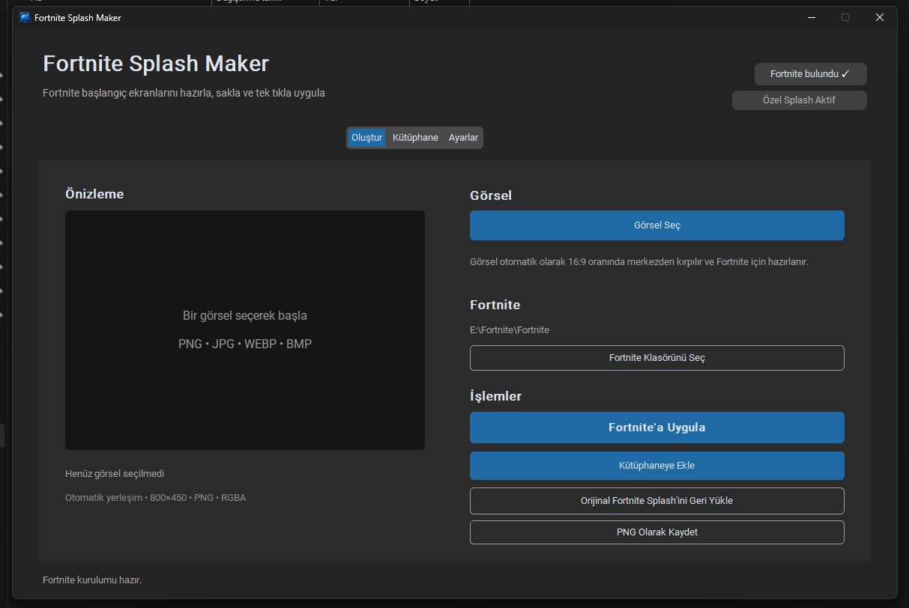
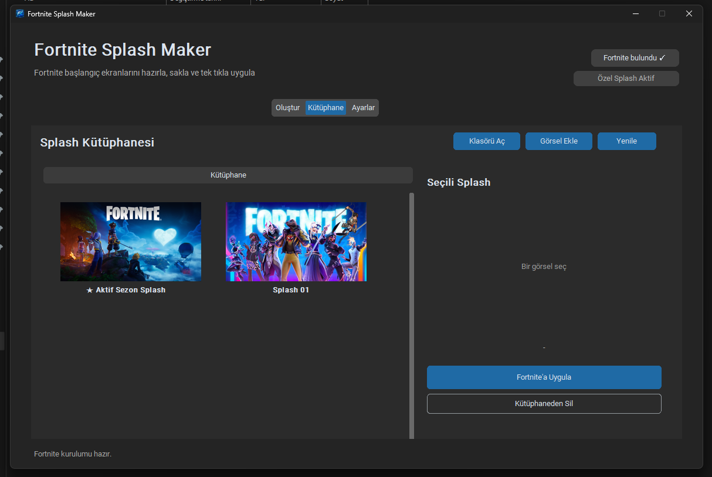
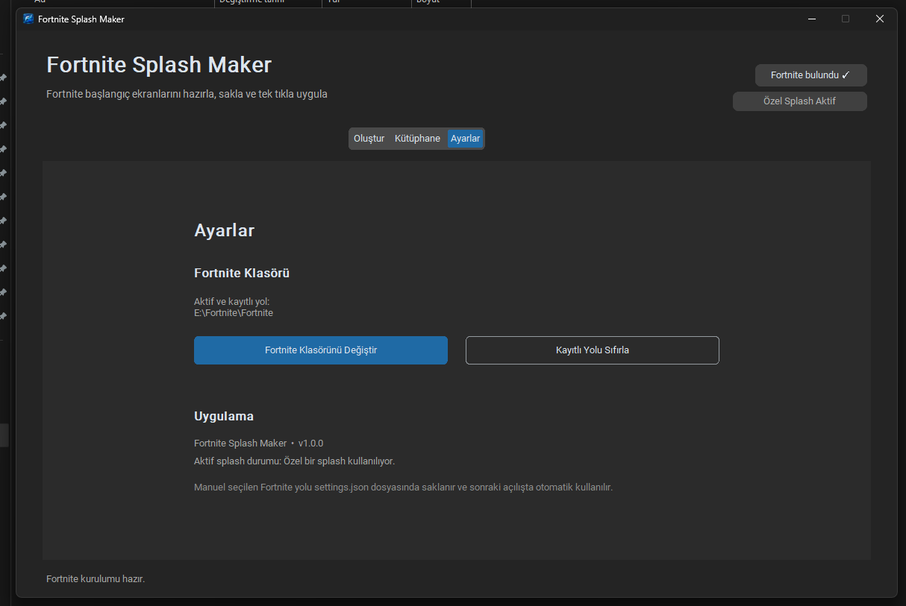

# Fortnite Splash Maker

Fortnite Easy Anti-Cheat başlangıç ekranını kolayca değiştirmek, özel splash görselleri hazırlamak ve yerel bir kütüphanede saklamak için geliştirilmiş Windows masaüstü uygulaması.



## Özellikler

- Fortnite Easy Anti-Cheat splash görselini değiştirme
- PNG, JPG, JPEG, WEBP ve BMP desteği
- Görselleri otomatik olarak 800×450 PNG RGBA formatına hazırlama
- Fortnite kurulumunu otomatik algılama
- Manuel Fortnite klasörü seçme ve yolu hatırlama
- Yerel splash kütüphanesi
- Kütüphaneye görsel ekleme, silme ve tekrar uygulama
- Aktif sezon splash görselini geri yükleme
- Aktif splash durumunu algılama
- Windows için paketlenmiş EXE ve Setup sürümü
- Özel uygulama ikonu

## Kütüphane

Hazırladığınız splash görsellerini uygulamanın yerel kütüphanesinde saklayabilirsiniz.



## Ayarlar

Ayarlar sayfasından Fortnite kurulum yolunu görüntüleyebilir veya değiştirebilirsiniz.

Uygulama mümkün olduğunda Fortnite kurulumunu Epic Games Launcher verilerinden otomatik olarak algılar.



## İndirme

En güncel sürümü GitHub Releases sayfasından indirebilirsiniz.

### Önerilen

`FortniteSplashMaker-v1.0.0-Setup.exe`

Normal Windows kurulumu yapar.

### Portable

`FortniteSplashMaker-v1.0.0-win64.zip`

ZIP dosyasını bir klasöre çıkarın ve `FortniteSplashMaker.exe` dosyasını çalıştırın.

## Kullanım

1. Uygulamayı açın.
2. Fortnite kurulumu otomatik olarak algılanır.
3. Algılanamazsa Fortnite klasörünü manuel olarak seçin.
4. `Görsel Seç` butonuyla kullanmak istediğiniz resmi seçin.
5. Uygulama görseli otomatik olarak 800×450 RGBA PNG formatına hazırlar.
6. `Fortnite'a Uygula` butonuna basın.
7. İsterseniz hazırladığınız görseli kütüphaneye ekleyin.
8. Varsayılan splash'e dönmek için `Aktif Sezon Splash'ini Geri Yükle` seçeneğini kullanın.

## Proje Yapısı

```text
FortniteSplashMaker/
├─ assets/
│  ├─ app_icon.ico
│  ├─ app_icon.png
│  └─ current_season_splash.png
├─ docs/
│  ├─ screenshots/
│  │  ├─ create.png
│  │  ├─ library.png
│  │  └─ settings.png
│  ├─ BUILD.md
│  ├─ RELEASE.md
│  └─ INSTALLER.md
├─ installer/
│  └─ installer.iss
├─ library/
├─ scripts/
│  ├─ build.ps1
│  ├─ build.bat
│  ├─ release.ps1
│  ├─ release.bat
│  ├─ build-installer.ps1
│  └─ build-installer.bat
├─ main.py
├─ requirements.txt
├─ .gitignore
└─ README.md
```

`build/`, `dist/`, `release/`, `settings.json` ve kullanıcı kütüphanesi Git tarafından takip edilmez.

## Gereksinimler

- Windows
- Python 3.12 veya üzeri
- CustomTkinter
- Pillow
- PyInstaller

```powershell
pip install -r requirements.txt
```

## Kaynak Koddan Çalıştırma

```powershell
python main.py
```

## Windows EXE Oluşturma

```powershell
powershell -ExecutionPolicy Bypass -File .\scripts\build.ps1
```

veya `scripts\build.bat`.

Çıktı:

```text
dist\FortniteSplashMaker\FortniteSplashMaker.exe
```

## Portable Release Oluşturma

```powershell
powershell -ExecutionPolicy Bypass -File .\scripts\release.ps1
```

veya `scripts\release.bat`.

Çıktı:

```text
release\FortniteSplashMaker-v1.0.0-win64.zip
```

## Windows Installer Oluşturma

Önce normal build alın:

```powershell
powershell -ExecutionPolicy Bypass -File .\scripts\build.ps1
```

Ardından:

```powershell
powershell -ExecutionPolicy Bypass -File .\scripts\build-installer.ps1
```

veya `scripts\build-installer.bat`.

Çıktı:

```text
release\FortniteSplashMaker-v1.0.0-Setup.exe
```

## Belgeler

- `docs/BUILD.md` — normal EXE build süreci
- `docs/RELEASE.md` — portable release paketi
- `docs/INSTALLER.md` — Windows installer süreci

## Kullanıcı Verileri

`settings.json` çalışma sırasında otomatik oluşturulabilir.

Kullanıcı splash görselleri `library\` klasöründe tutulur ve Git deposuna eklenmez.

## Aktif Sezon Splash

Bilinen aktif sezon görseli:

```text
assets\current_season_splash.png
```

`Aktif Sezon Splash'ini Geri Yükle` seçeneği bu görseli Fortnite'ın Easy Anti-Cheat splash dosyasına uygular.

## Yetki Sorunları

Fortnite kurulum klasörüne yazma izni yoksa uygulamayı yönetici olarak çalıştırmak gerekebilir.

## Windows SmartScreen

Uygulama ticari bir kod imzalama sertifikasıyla imzalanmadığı için Windows bazı sistemlerde SmartScreen uyarısı gösterebilir.

## Sürüm

Güncel sürüm: `v1.0.0`

## Lisans ve Yasal Uyarı

Bu proje bağımsız bir topluluk aracıdır.

Epic Games tarafından geliştirilmemiş, desteklenmemiş veya resmî olarak onaylanmamıştır.

Fortnite ve ilgili marka, logo ve isimler Epic Games'in mülkiyetindedir.
